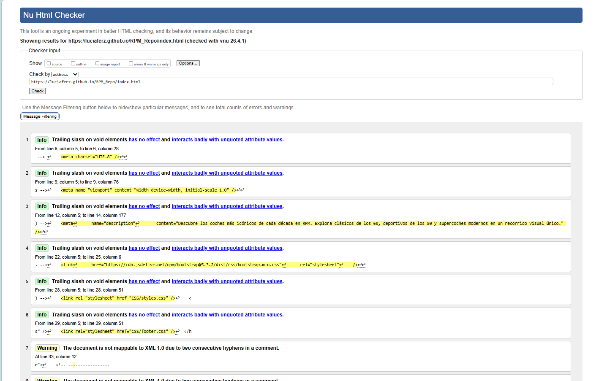
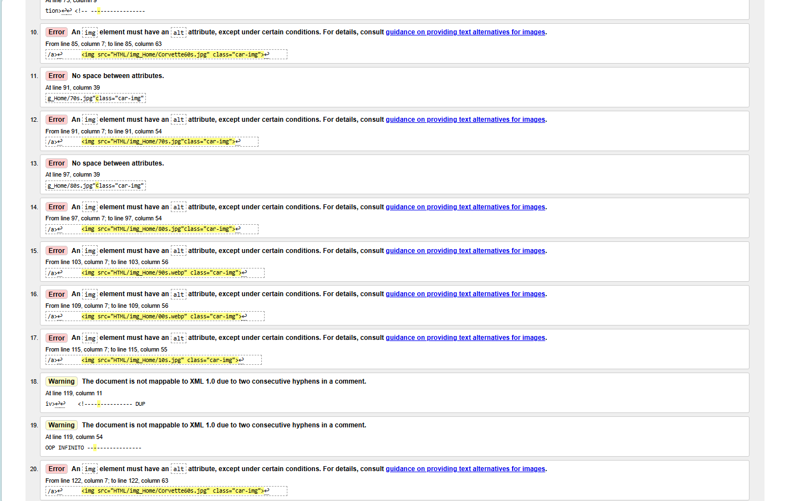
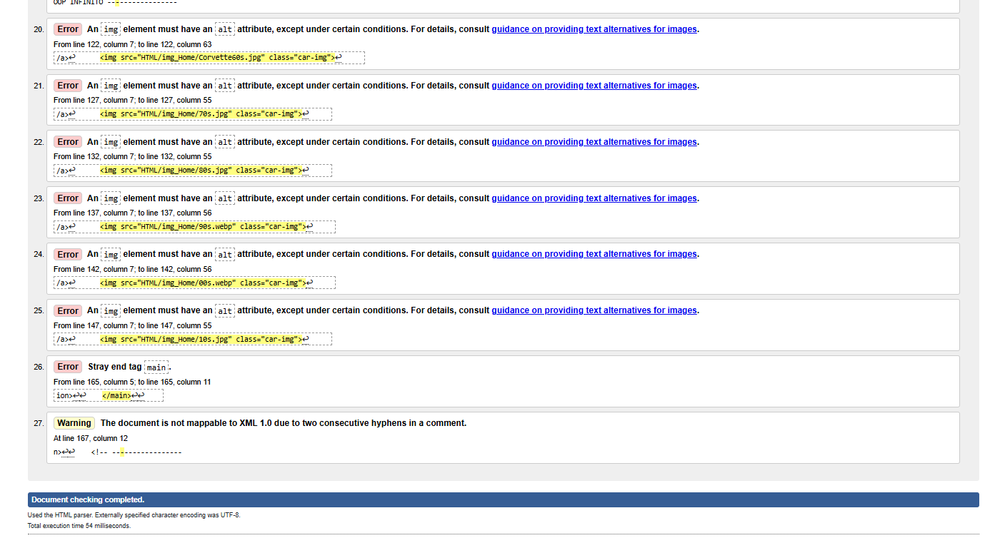
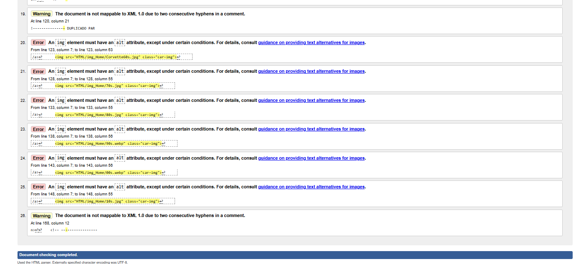
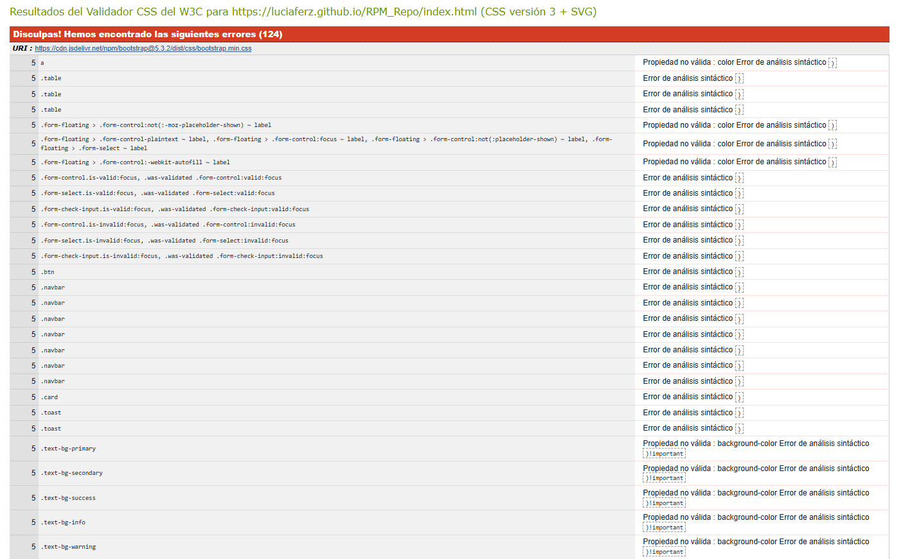
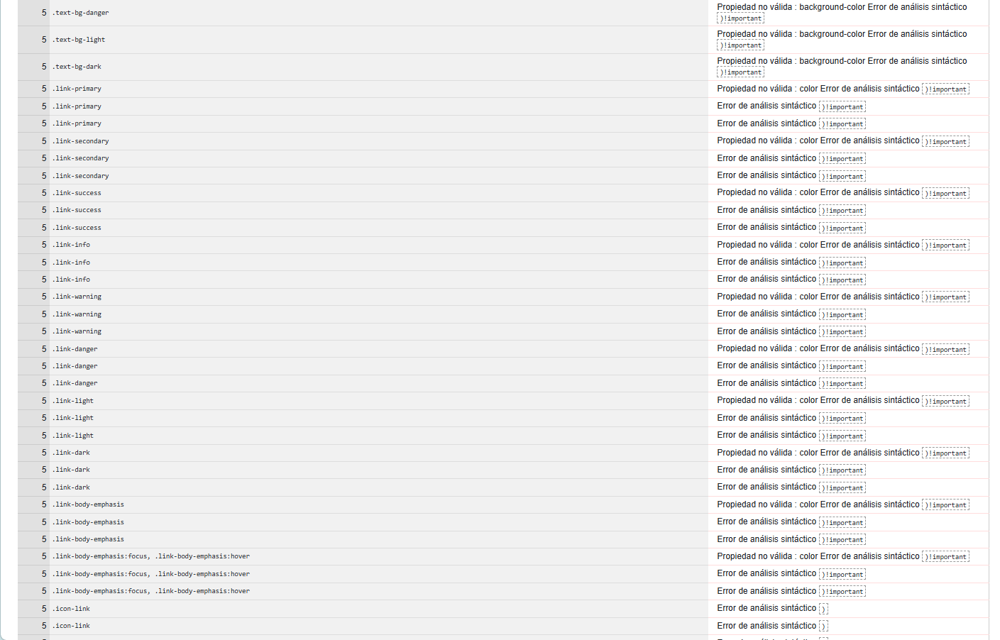
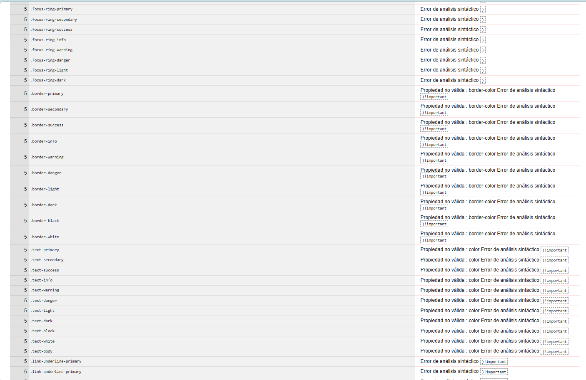
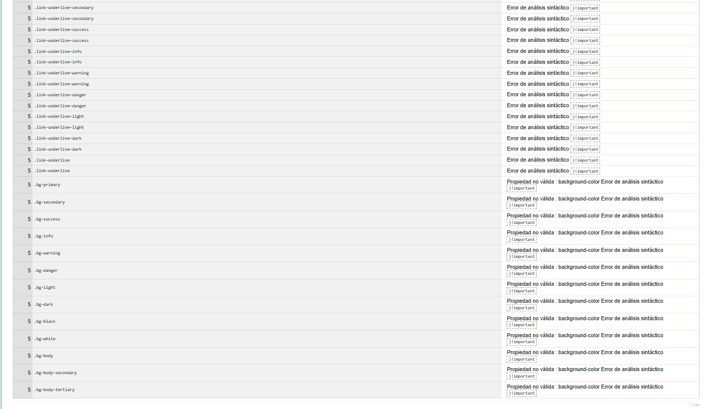

# Documentación del proyecto RPM_Repo

### 1) Estructura del proyecto

#### Árbol de carpetas y archivos

```
RPM_Repo/
├── index.html                 # Página principal (Home)
├── CSS/
│   ├── styles.css             # Estilos globales: menú, hero, carrusel
│   ├── Decadas.css            # Estilos específicos de décadas
│   ├── contacto.css           # Estilos del formulario
│   └── footer.css             # Estilos del pie de página
├── Java_Script/
│   ├── script.js              # Funciones comunes: slider, validación
│   └── Decadas.js             # Gestión de décadas y galería
└── HTML/
    ├── Contacto/
    │   └── contacto.html       # Formulario de contacto
    ├── Decadas/
    │   ├── secciones.html      # Galería de coches
    │   ├── img_60s/
    │   ├── img_70s/
    │   ├── img_80s/
    │   ├── img_90s/
    │   ├── img_00s/
    │   └── img_10s/
    └── img_Home/               # Imágenes del carrusel (Home)
```

#### Relación entre páginas

- **Home**: `index.html`
- **Secciones**: `HTML/Decadas/secciones.html` (selección de década)
- **Contacto**: `HTML/Contacto/contacto.html`

---

### 2) Tecnologías utilizadas

- **HTML5**: estructura semántica.
- **CSS3**: estilos y animaciones (Flexbox, Grid, `@keyframes`, `@media`, variables CSS).
- **Bootstrap 5.3.2**: sistema de rejilla (grid) y *utility classes* vía CDN.
- **jQuery 3.7.1**: manipulación del DOM y eventos (`$()`, `.on()`, `.html()`, `.text()`, `.attr()`).
- **Google Fonts**: Bebas Neue, Cairo, Oswald.

---

### 3) CSS (resumen de lo usado)

#### `styles.css`

- Variables CSS: `var(--btn-color, #f20a0a)`
- Flexbox: `display: flex`, `justify-content`, `align-items`, `gap`
- Transiciones: `transition: color 0.4s ease`
- Pseudo-elementos: `::before`, `::after`
- Animaciones: `@keyframes fadeInUp`
- Responsive: `@media (max-width: ...)`
- Ajuste fluido: `clamp()`
- Modelo de caja: `box-sizing: border-box`
- Bordes: `border-radius`

#### `Decadas.css`

- Variables por década: `--decade-color: #e63946` (tema por sección)
- Grid: `display: grid`, `grid-template-columns`, `repeat()`, `minmax()`
- Atributos `data-*`: por ejemplo `data-decade`
- Selectores: `:not()`, hermanos adyacentes (`.a + .b`)
- Filtros visuales: `blur()`, `brightness()`

#### `contacto.css`

- Grid para maquetación del formulario
- Estilos de autocompletado: `-webkit-autofill`

#### `footer.css`

- Tipografías y tamaños fluidos con `clamp()`

---

### 4) JavaScript / jQuery (resumen de lo usado)

#### Operaciones jQuery habituales

- Selección DOM: `$("selector")`, `.find()`, `.closest()`, `.siblings()`
- Contenido y atributos: `.text()`, `.html()`, `.attr()`
- Clases: `.addClass()`, `.removeClass()`, `.toggleClass()`, `.hasClass()`
- Eventos: `.on()`, delegación, `.trigger("focus")`
- Iteración: `.each()`
- Formularios: `.val()`, `.show() / .hide()`
- DOM listo: `$(function() { ... })`

#### APIs del navegador

- `window.location.search` + `URLSearchParams` para leer parámetros
- `requestAnimationFrame()` para animaciones (p. ej. loop del carrusel)
- `event.preventDefault()` para bloquear envíos inválidos

#### Lógica del proyecto (alto nivel)

- **Validación de formulario**: `getFieldMessage()` y `updateFieldState()` validan en tiempo real y previenen envíos incorrectos.
- **Datos por década**: objeto `DECADES` centraliza coches por década.
- **Render dinámico**:
    - `renderDecade()` inyecta contenido en el DOM.
    - `createCardHtml()` y `createGalleryHtml()` generan tarjetas y miniaturas.
- **Galería**:
    - `setupGalleryEvents()` gestiona clic en miniaturas.
    - `setupInfoToggleEvents()` controla paneles de información.
- **Carrusel**: bucle infinito con `requestAnimationFrame()`, con pausa al hacer *hover*.

---

### 5) Tablas de referencia rápida

#### CSS

| Comando | Archivo | Función |
| --- | --- | --- |
| var(--variable, default) | styles.css, Decadas.css | Variables CSS reutilizables |
| display: flex | styles.css | Layout flexible |
| grid-template-columns: repeat(3, 1fr) | Decadas.css | Grid de 3 columnas |
| clamp(min, %, max) | styles.css, footer.css | Tamaño responsive fluido |
| transition: 0.4s ease | styles.css | Animación suave en cambios |
| @keyframes fadeInUp | styles.css | Definición de animación |
| ::before / ::after | styles.css | Pseudo-elementos decorativos |
| --custom-property | Decadas.css | Colores/tema por década |
| data-* attribute | Decadas.css | Datos personalizados para lógica/estilo |
| .clase1 + .clase2 | Decadas.css | Selector hermano adyacente |
| @media (max-width: X) | Todos | Breakpoints responsive |
| border-radius: 999px | styles.css | Botón tipo cápsula |
| box-sizing: border-box | styles.css | Modelo de caja consistente |
| object-fit: cover | styles.css | Imagen sin distorsión |

#### JavaScript / jQuery

| Comando | Archivo | Función |
| --- | --- | --- |
| $("selector") | script.js, Decadas.js | Selector jQuery |
| .attr("attr", "valor") | script.js | Get/Set atributos |
| .text("texto") | script.js | Modificar texto |
| .html("html") | Decadas.js | Insertar HTML |
| .addClass() / .removeClass() / .toggleClass() | script.js, Decadas.js | Gestión de clases |
| .hasClass("clase") | Decadas.js | Comprobar clase |
| .on("evento", fn) | script.js, Decadas.js | Registrar eventos |
| .each(fn) | script.js, Decadas.js | Iterar elementos |
| .find() / .closest() / .siblings() | Decadas.js | Navegación por el DOM |
| .val() | script.js | Valor de input |
| .show() / .hide() | script.js | Mostrar/ocultar elementos |
| $(function() { ... }) | Todos | Ejecutar al cargar el DOM |
| URLSearchParams | Decadas.js | Parsear parámetros de URL |
| requestAnimationFrame() | Decadas.js | Animación fluida (≈60fps) |
| event.preventDefault() | script.js | Bloquear envío inválido |

---

### 6) Flujo de navegación

```
Home
├── Secciones → Galería (clic década) → Ver coches
│   ├── Cambiar imágenes (miniaturas)
│   └── Info toggle (panel de detalles)
└── Contacto → Formulario → Validación → Envío
```

# Validación

Hemos usado los siguientes validadores sobre nuestra página:

- [Validador CSS del W3C](https://jigsaw.w3.org/css-validator/)
- [Validador HTML del W3C](https://validator.w3.org/)

Página validada:  
https://luciaferz.github.io/RPM_Repo/index.html

---

## Errores en HTML

Los errores que nos salen en el HTML son:





Estos errores corresponden a:
- Falta del atributo `alt` en los elementos ``, necesario para accesibilidad.
- Un aviso sobre la etiqueta `<main>`,por un error de apertura.

---

## Solución aplicada a la etiqueta main

     


---

## Errores en CSS

Los errores detectados en CSS son:






Estos errores aparecen porque el validador no reconoce algunas propiedades modernas utilizadas por **Bootstrap**, framework empleado en el desarrollo del proyecto.

---

## Conclusión

Aunque el validador muestra errores, muchos de ellos no afectan al funcionamiento real de la página, ya que están relacionados con tecnologías actuales no totalmente soportadas por la herramienta de validación.
